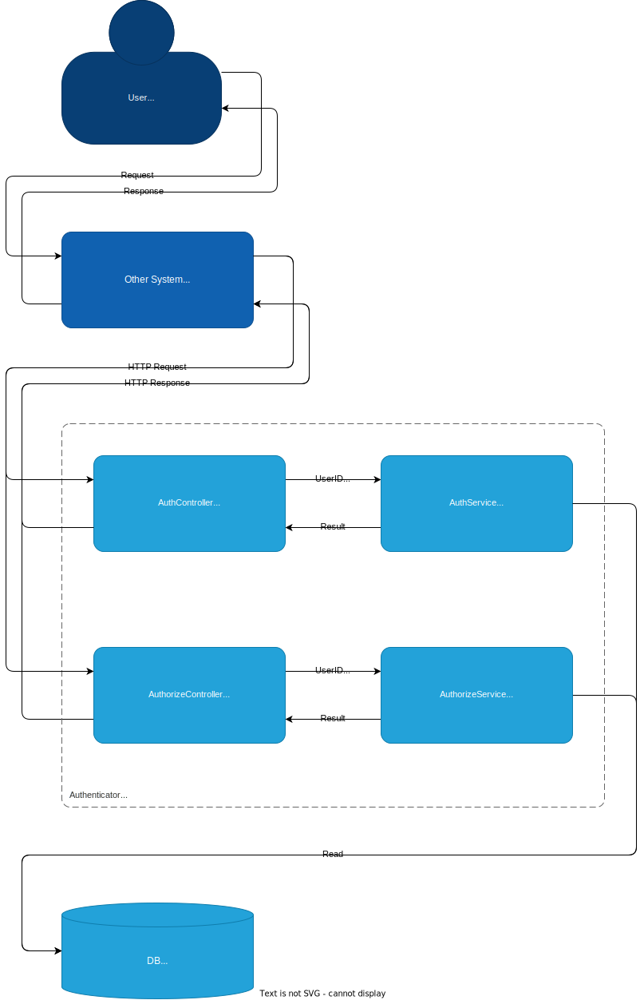

# Architecture

## About



## Structure

### Containers (Develop)


### Files

```
authenticator
|
+-- .devcontainer
|   |
|   +-- devcontainer.json
|
+-- server
|   |
|   +-- Laravel Code
|
+-- client
|   |
|   +-- Vue Code
|
+-- build
|   |
|   +-- server
|   |   |
|   |   +-- Dockerfile
|   |
|   +-- client
|   |   |
|   |   +-- Docekrfile
|   |
|   +-- .env
|   |
|   +-- docker-compoer.yml
|
+-- server.code-workspace   // VSCode Workspace for Server
|
+-- client.code-workspace   // VSCode Workspace for Client
|
+-- docs
    |
    +-- assets
    |   |
    |   +-- *.svg
    |
    +-- *.md
```
